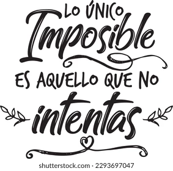

# curso de programacion
## MODULO HTML y CSS
- Que es html y css
- etiquetas mas utilizadas
- css
   - clases y pseudoclases
- bootstrap 

## MODULO *JAVASCRIPT*
## MODULO _PHP Y MSYQL_
## MODULO **PYTHON**
> Empieza donde estás, usa lo que tienes y haz lo que puedas.
Y mientras avanzas, confía en que cada pequeño paso construye algo más grande.
No esperes el momento perfecto: créalo con tu esfuerzo diario.
Lo importante no es tenerlo todo resuelto, sino tener la voluntad de comenzar, aprender en el camino y nunca dejar de crecer.
{google fonts}(https://es.linkedin.com/)

  <width="200px" height="200px" alt="frases">
 <width="200px" height="200px" alt="frase1">
```<h1> hola mundo de markdowm </h1>```